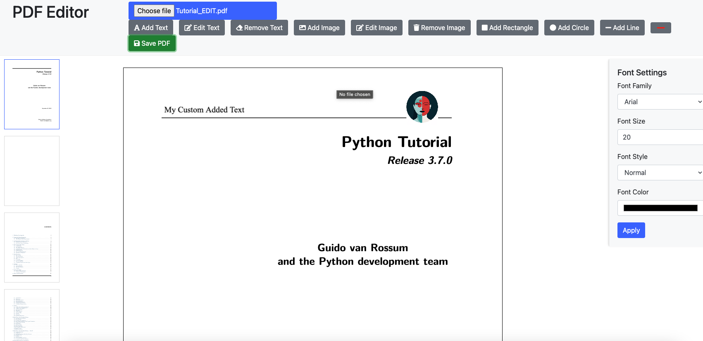

# PDF Editor

## need to install
pip install django pymupdf pillow reportlab

# need to run
python manage.py makemigrations 
python manage.py migrate   
python manage.py runserver

## need to create 
mkdir media     
mkdir media/pdfs 

## Dictionary to map font names and styles to file paths
FONT_FILES = {
    'Arial': {
        'normal': os.path.join(settings.MEDIA_ROOT, 'fonts', 'Arial.ttf'),
        'bold': os.path.join(settings.MEDIA_ROOT, 'fonts', 'ArialBold.ttf'),
        'italic': os.path.join(settings.MEDIA_ROOT, 'fonts', 'ArialItalic.ttf')
    },
    'Times New Roman': {
        'normal': os.path.join(settings.MEDIA_ROOT, 'fonts', 'TimesNewRoman.ttf'),
        'bold': os.path.join(settings.MEDIA_ROOT, 'fonts', 'TimesNewRomanBold.ttf'),
        'italic': os.path.join(settings.MEDIA_ROOT, 'fonts', 'TimesNewRomanItalic.ttf')
    },
    'Courier New': {
        'normal': os.path.join(settings.MEDIA_ROOT, 'fonts', 'CourierNew.ttf'),
        'bold': os.path.join(settings.MEDIA_ROOT, 'fonts', 'CourierNewBold.ttf'),
        'italic': os.path.join(settings.MEDIA_ROOT, 'fonts', 'CourierNewItalic.ttf')
    },
    'Verdana': {
        'normal': os.path.join(settings.MEDIA_ROOT, 'fonts', 'Verdana.ttf'),
        'bold': os.path.join(settings.MEDIA_ROOT, 'fonts', 'VerdanaBold.ttf'),
        'italic': os.path.join(settings.MEDIA_ROOT, 'fonts', 'VerdanaItalic.ttf')
    },
    'Tahoma': {
        'normal': os.path.join(settings.MEDIA_ROOT, 'fonts', 'Tahoma.ttf'),
        'bold': os.path.join(settings.MEDIA_ROOT, 'fonts', 'TahomaBold.ttf'),
        'italic': os.path.join(settings.MEDIA_ROOT, 'fonts', 'TahomaItalic.ttf')
    }
}